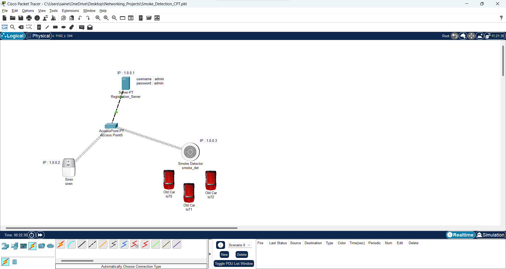
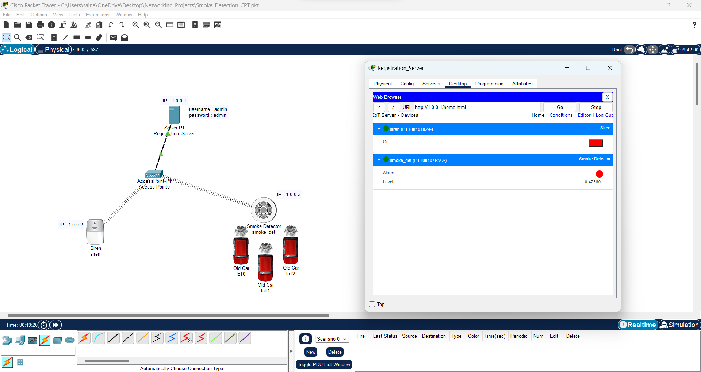
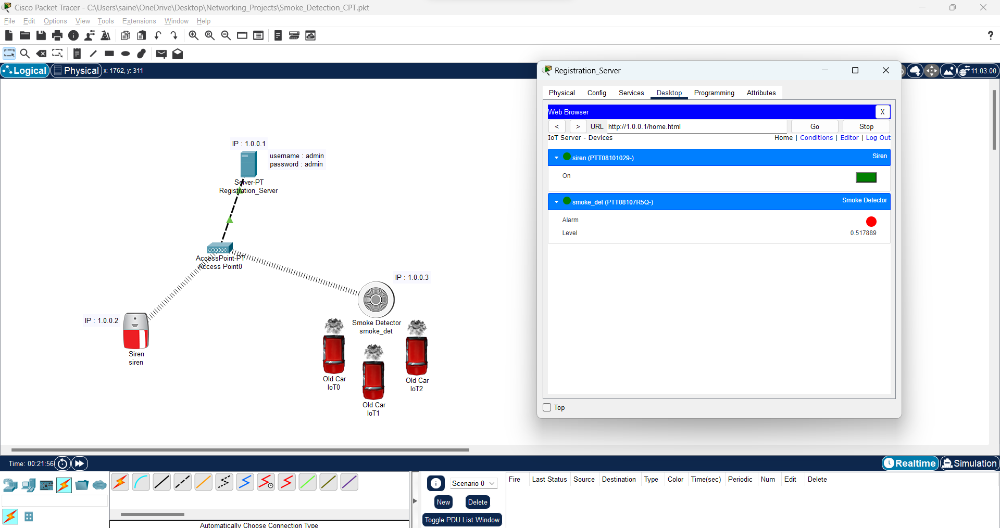

# Smoke_Detection_using_CiscoPacketTracer

## **Problem Statement :**

To detect smoke and activate a siren using Cisco Packet Tracer

## **Steps involved :**
  - Add a Server, an Access Point, a Smoke detector, a Siren, a few Old Cars that can emit smoke.
  - Set an SSID to the access point (I've set it to "cisco") and configure the Siren and Smoke detector to the same SSID.
  - Connect the access point to the server using a physical LAN.
  - Assign IP addresses to the Server, Siren and Smoke detector in the IP configuration section.
  - Convert the server to Registration Server by toggling its service to ON on the Services section.
  - Now go to the web browser and go into the IP address of server and create an account.
  - Connect the Siren and Smoke detector to the IoT Remote Server using the address of the Registration Server, Username and Password.
  - Now Sign in and add necessary conditions in the Web browser.
  - After this, If the Old cars are made to emit smoke, the Siren will get activated as soon as the detected smoke level exceeds the threshold set in the conditions.
  
  
  ## **Working :**

**Setup :**

**Before Smoke level exceeds 0.5 :**

**After Smoke level exceeds 0.5 :**

